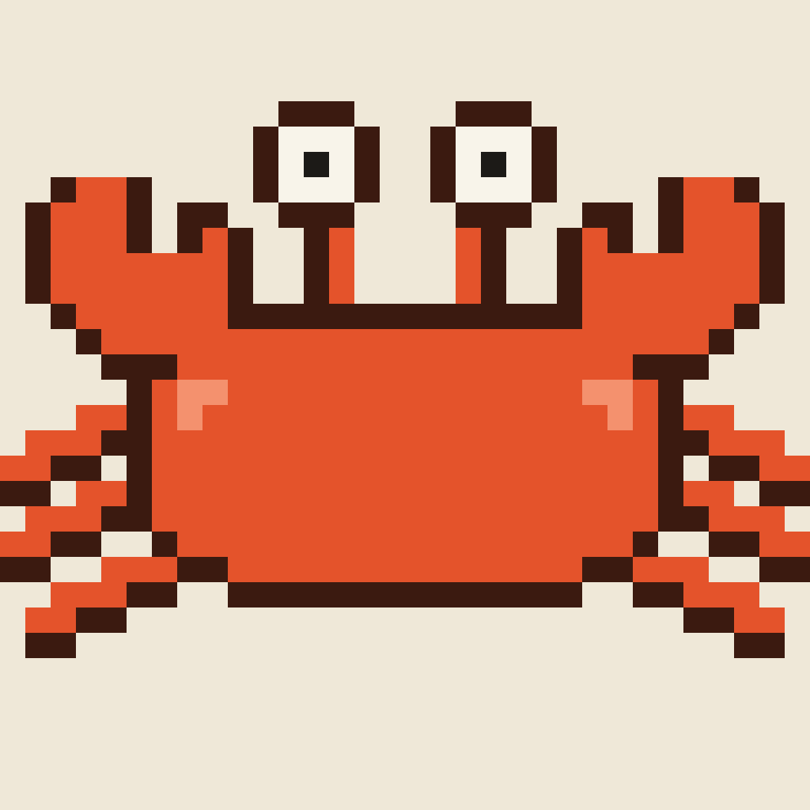
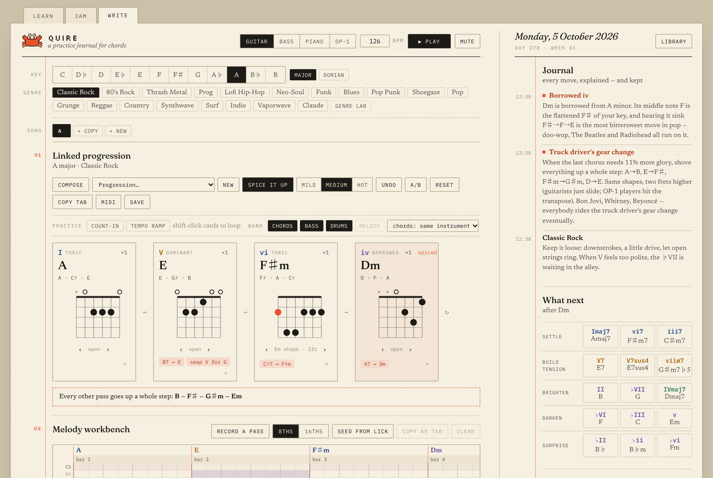
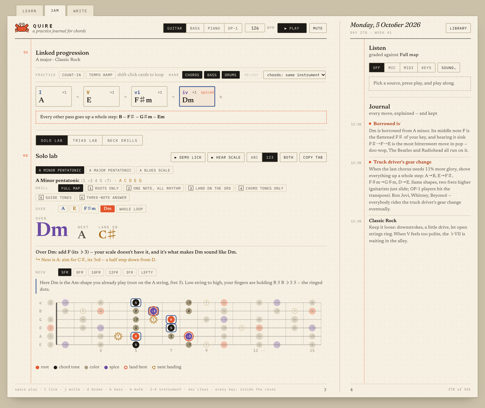
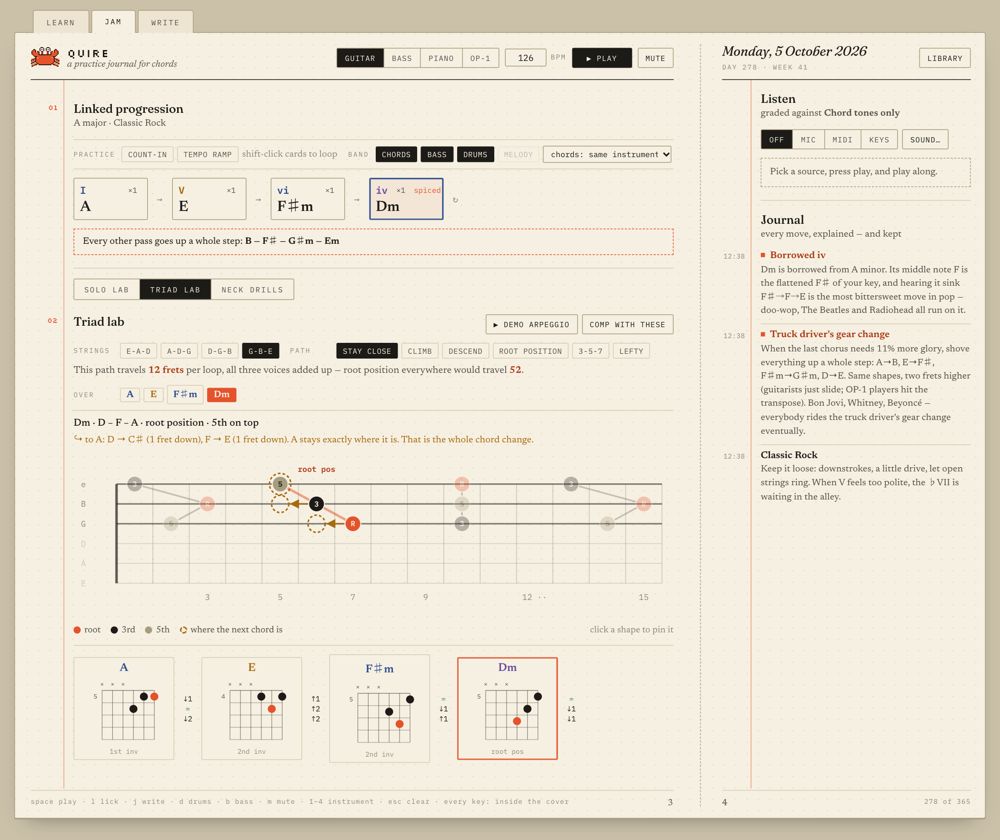
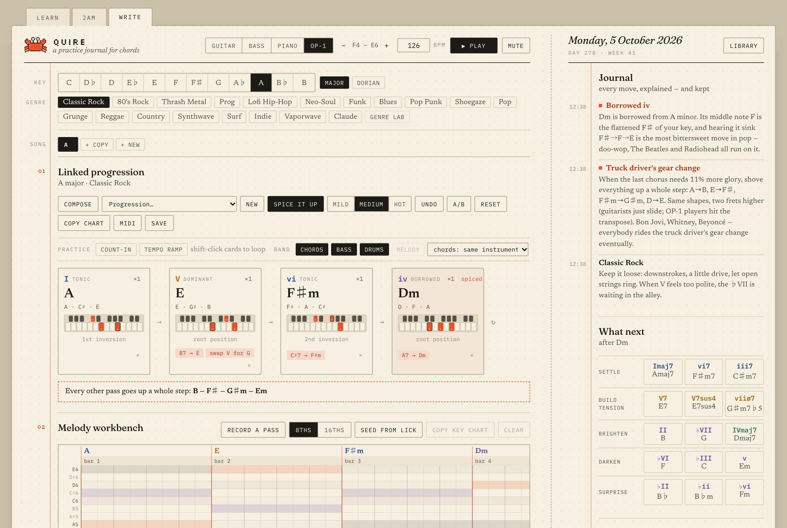
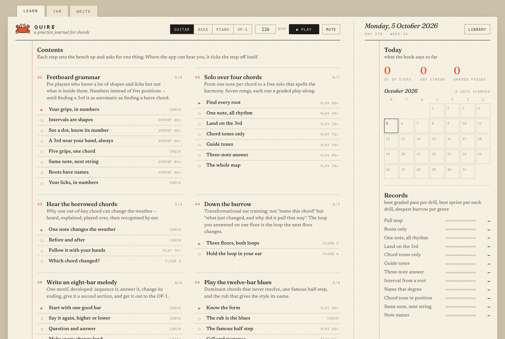
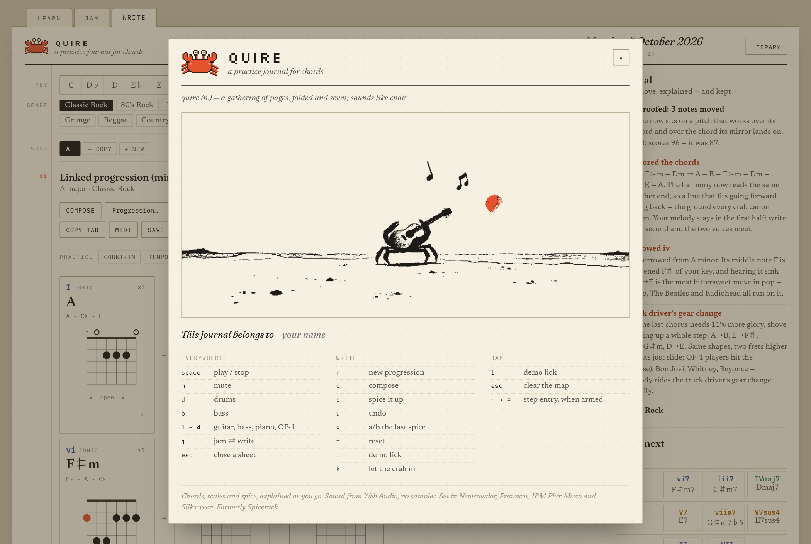
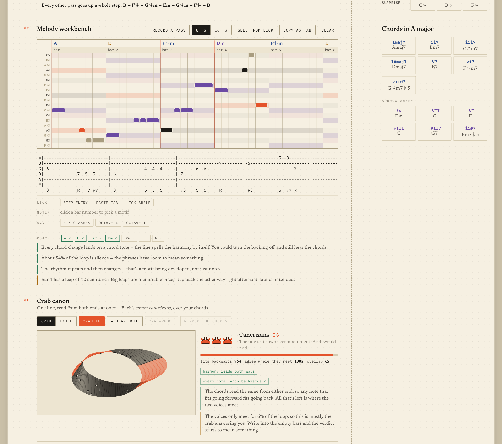
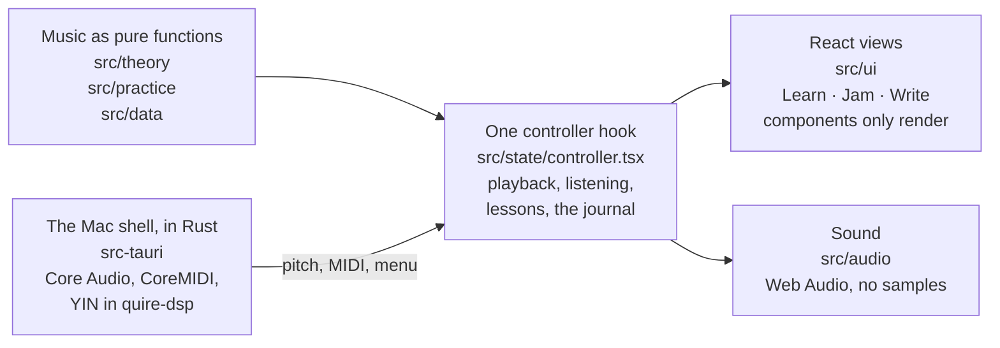

<p align="center">
  
</p>

<h1 align="center">Quire</h1>

<p align="center">
  <b>a practice journal for chords</b><br>
  <i>A quire is a gathering of pages, folded and sewn; it sounds like choir.</i>
</p>

<p align="center">
  A desktop app that writes chord progressions, changes them one move at a time,<br>
  explains every change in plain words, and listens while you play along.
</p>

<p align="center">
  
  
  
  
  
  <a href="LICENSE"></a>
</p>

<p align="center"><a href="#run-it">Run it</a> · <a href="docs/features.md">The complete tour</a> · <a href="#how-it-is-built">How it is built</a> · <a href="docs/guide.md">A quick guide</a></p>

<p align="center">
  
</p>
<p align="center"><sub>Write, in A major, Classic Rock. Two presses of <i>Spice it up</i> turned D into Dm (a borrowed iv) and made every other pass climb a whole step; the journal on the right page says why, in the app's own words, with the time it said it.</sub></p>

## What it does

Pick a key and a genre and Quire puts an idiomatic progression on the bench.
Press **Spice it up** and the spice rack makes a move (a secondary dominant, a
borrowed iv, a tritone sub, a passing diminished, the truck driver's gear
change: 23 in all) and writes into the journal what it did and why. It plays
everything it shows, and it shows every chord for guitar, bass, piano or the
OP-1 field's two-octave keyboard. It is the software version of those die-cut
"chord folder" tools, except that it plays, listens and explains itself.

| Page | What happens there |
| --- | --- |
| **Learn** | The contents: eight paths of short steps (39 in all), each of which sets the bench up and asks for one thing. Where the app can hear you, it ticks the step off itself. The month as a stamp card, the records, and the burrow. |
| **Jam** | Instrument in hand. The chords shrink to a chart and the page goes to one tool: the Solo lab, the Triad lab or the Neck drills. Press play and the app listens (microphone, audio interface, MIDI or the computer keyboard) and grades each pass. |
| **Write** | The bench: key, mode and genre (19 genres, and a Genre lab for your own), song sections, the chords with every harmonic tool, *What next*, the melody workbench and the crab canon, with the journal alongside. |

<p align="center">
  
  
</p>
<p align="center"><sub><b>Jam.</b> Left: the Solo lab over the borrowed Dm, every note numbered from the chord that is sounding. F is marked as a spice (Dm's ♭3, which the A minor pentatonic doesn't have), the grip you already play is ringed, and dashed rings show where to land when A comes back. Right: the Triad lab on the top three strings; the solver's path travels 12 frets a loop, where root position everywhere would travel 52.</sub></p>

<details>
<summary>More of the journal: the OP-1 field's keys, Learn, and the inside cover</summary>
<br>

<p align="center"><sub>The same bench on the OP-1 field: each card shows its 24 keys with the inversion that fits one hand.</sub></p>

<p align="center"><sub>Learn: the contents and, on the right page, Today, the month's stamp card and the records. This journal is brand new, so every counter reads zero and no day is stamped yet.</sub></p>

<p align="center"><sub>The inside cover, opened from the wordmark: the gloss, a plate, whose journal it is, every keyboard shortcut, and a colophon.</sub></p>
</details>

**The look.** An open notebook on a desk: a two-page spread with a stitched
gutter, cream paper with a faint dot grid, a vermilion margin rule, running
heads and folios. Teaching text is set in Newsreader, headings in Fraunces,
labels in IBM Plex Mono capitals; harmonic function and note roles keep their
own inks because they mean something. Apart from one plate on the inside cover,
the only decoration is a 32×24 pixel crab, placed by hand and drawn as SVG
rects: the wordmark (it walks while the band plays), the app icon, the canon's
cursor, the verdict's rating, the stamp on every practice day. No emoji.

## Four ideas worth a closer look

### The burrow: ear training as a descent

Most ear training asks you to name a chord; the burrow asks what just changed.
The crab digs under one of your genre's loops a floor at a time: on every floor
the spice rack changes one chord of the loop as it now stands, the loop plays,
and you point at the chord that moved. Floors 1–3 play the old loop first; from
floor 4 only the new one plays, so the old one has to be held in your ear. Where
the genre carries the truck driver, floor 4 turns the whole loop up a whole
step, and from floor 8 two chords change at once. The burrow leans toward
spices your journal has never mentioned, so over weeks it becomes a curriculum
of the moves you have not heard yet. However the descent ends, the loop lands
on the Write bench with every floor written into the journal.
[One descent, floor by floor.](docs/features.md#one-descent-floor-by-floor)

### A crab canon on a Möbius strip

Bach's *canon cancrizans* (Musical Offering, 1747) is one line of music that
accompanies itself when a second player reads it from the end. Write a melody,
press **Let the crab in**, and a second voice plays it backwards over your
chords. The line is drawn on a Möbius strip (an SVG computed from the parametric
surface and painted far to near), with the playhead and the crab walking it in
opposite directions. A verdict scores how well the line agrees with itself and
names every miss; **Mirror the chords** makes the harmony a palindrome, and
**Crab-proof** moves each unlocked note to the nearest pitch that works both
ways, never handing back a worse score than it was given.

<p align="center">
  
</p>
<p align="center"><sub>Write, further down: the melody workbench (a piano roll tinted by the harmony, tab with each note's degree underneath, the coach's notes) and the crab canon after <i>Seed from lick</i>, <i>Let the crab in</i>, <i>Mirror the chords</i> and <i>Crab-proof</i>. The verdict is Cancrizans, 96, and it points out that the two voices only meet for 6% of the loop.</sub></p>

### Triads that barely move

Every chord as three notes on three adjacent strings (or under one hand on the
keys), in every inversion, and a path through the progression where each shape
sits a fret or two from the last. The solver is a small dynamic program over
every playable shape of every chord, run once per starting shape so the seam
back to the top of the loop is priced in. *Stay close* moves least, *Climb* and
*Descend* make the top voice a melody, *Root position* is the baseline most
people play; pin any shape and the rest of the path re-routes around it.

### It listens, and says something useful

Pick a source (the microphone, MIDI, the computer keyboard, or in the Mac app
your audio interface), press play and play along. What you play lights up on
the diagrams and is placed on the loop's clock, and each pass is graded against
the drill: ✓ or ✗ for every chord change, the share of notes inside the drill,
and one specific line ("Dm: you arrived on F♯ — aim for F"). Pitch comes from
YIN rather than an FFT peak, because a plucked string's second harmonic is often
louder than its fundamental. The detector is written in TypeScript and ported to
Rust, where the Mac app runs it on the interface's input.

## How it is built



- **Music theory as pure functions.** Spelling (B♭ in F, C♯ in A), roman
  numerals, the spice rack, the solo map, the triad solver, the crab canon,
  grading and the burrow are plain TypeScript with no React and no audio in
  them. One hook, `useAppController()`, wires them to React and the audio
  engine; components only render.
- **277 tests in 31 files**, beside the code they test: every grip in the
  chord-shape library at every root against its chord's formula; every genre's
  spice rack against its own templates; the pitch detector on sine waves at two
  sample rates, a louder second harmonic, a bass low E, a note that starts
  mid-frame, a noisy room and silence; the burrow dug in every genre from a
  seeded random number generator; a crab-proof solver that never returns a
  worse line.
- **A pitch detector in Rust.** `quire-dsp` is the YIN detector ported to Rust,
  with its own seven tests. A worker thread owns the Core Audio stream (cpal)
  and sends what it heard to the page about 47 times a second; the note tracker
  stays in TypeScript, so the microphone, the interface and the tests share one
  set of ears.
- **Screenshots that are retaken, margins that are checked.** `npm run shots`
  drives a headless Chrome over the DevTools protocol (nothing to install beyond
  Node 22 and Chrome), stages a session from a seeded roll of the spice rack,
  writes the pictures in this README, and exits 1 if any text touches the
  vermilion margin rule.
- **Nothing to load.** Every sound is synthesised in Web Audio (Karplus-Strong
  strings, small oscillator voices), with no samples; the four typefaces are
  bundled.

The source map, the Rust side's commands and events, and the deep links are in
[how it is built](docs/architecture.md).

## Run it

You need Node 22 or newer; the Mac app also needs Xcode's command line tools and
Rust ([rustup](https://rustup.rs)).

```bash
git clone https://github.com/CrabbTech/quire.git
cd quire
npm ci
npm run dev            # the journal in a browser, at http://localhost:1430
npm run tauri dev      # or as the Mac app (the first run compiles the Rust side)
npm test               # 277 tests, a few seconds
npm run tauri build    # Quire.app and a .dmg in src-tauri/target/release/bundle/
```

The browser build has everything except the native pieces (the audio interface
input, CoreMIDI and the menu bar); the microphone, Web MIDI in Chrome and Edge,
and the computer keyboard all work there. [The guide](docs/guide.md) has the
rest: checks, signing, retaking the screenshots, where your journal is kept.

## The Mac app

The same journal as a native macOS app, with what a web page cannot do: the
**audio interface straight in** through Core Audio (an amp sim such as
AmpliTube can read the same input, so you hear the amp while Quire grades the
dry string), **CoreMIDI** for the OP-1 field or any controller, and **a menu
bar** with the keys a Mac expects: <kbd>⌘</kbd> <kbd>P</kbd> plays,
<kbd>⌘</kbd> <kbd>⇧</kbd> <kbd>S</kbd> spices, <kbd>⌘</kbd> <kbd>,</kbd> opens
Sound. Setting it up
[next to an amp sim](docs/features.md#playing-next-to-an-amp-sim-amplitube-or-any-of-them)
takes three steps.

## Read more

- [A quick guide](docs/guide.md): get it running and find your way around.
- [The complete tour](docs/features.md): every feature, page by page; the 19
  genres, the 23 spices, the eight learning paths.
- [How it is built](docs/architecture.md): the layers, the source map, the Rust
  shell, the tests, the screenshot script.
- [Development notes](docs/development-notes.md): notes written between
  development sessions, kept as a record of why things are the way they are.

## Where it came from

Quire began as Spicerack 2, the second app in
[CrabbTech/spicerack](https://github.com/CrabbTech/spicerack), where the earlier
version and its history still live; it moved into this repository with its
history preserved. It was built by Tyler Crabb, working with an AI coding agent
(Claude Code); the commit history shows it.

Released under the [MIT licence](LICENSE).
